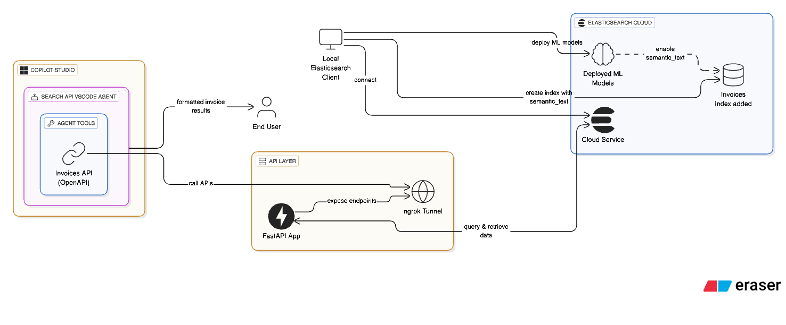
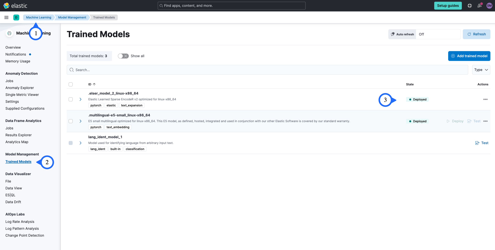
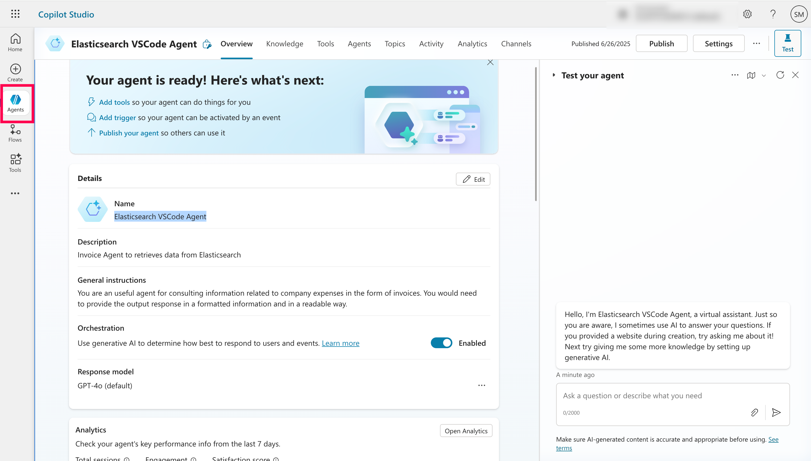
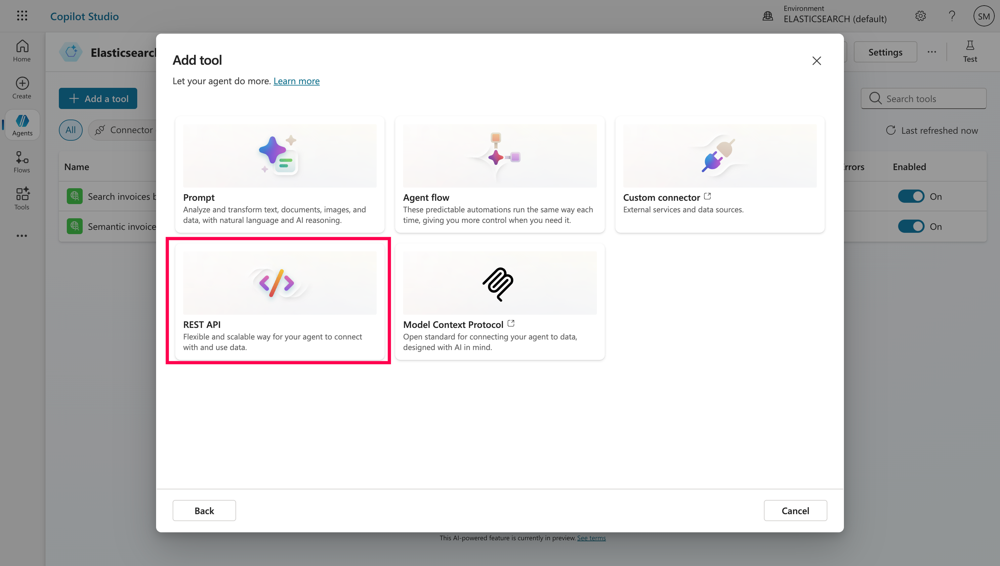
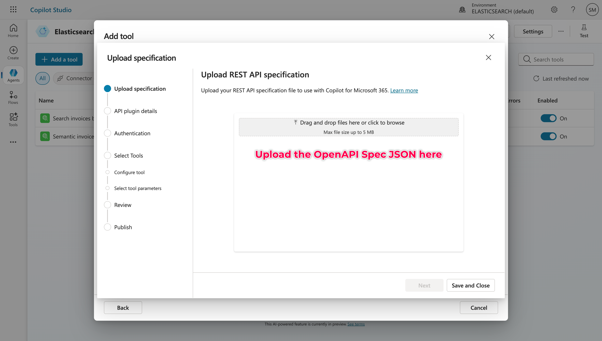
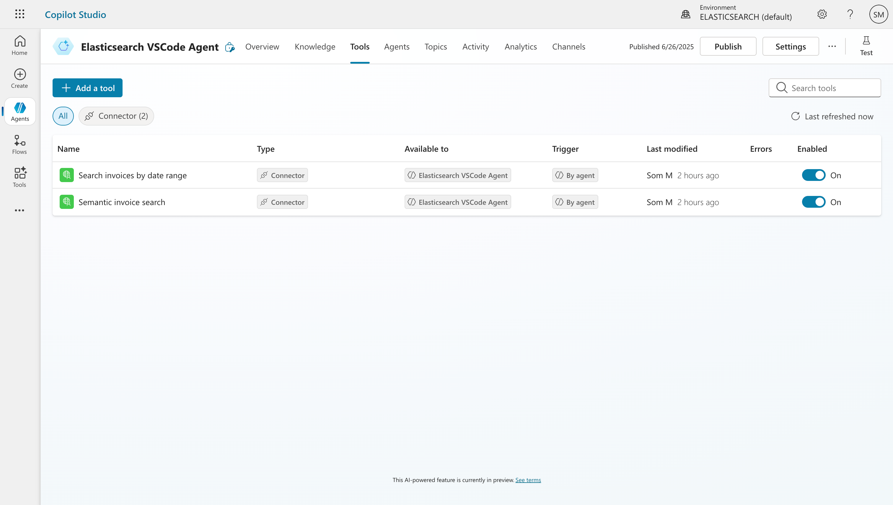
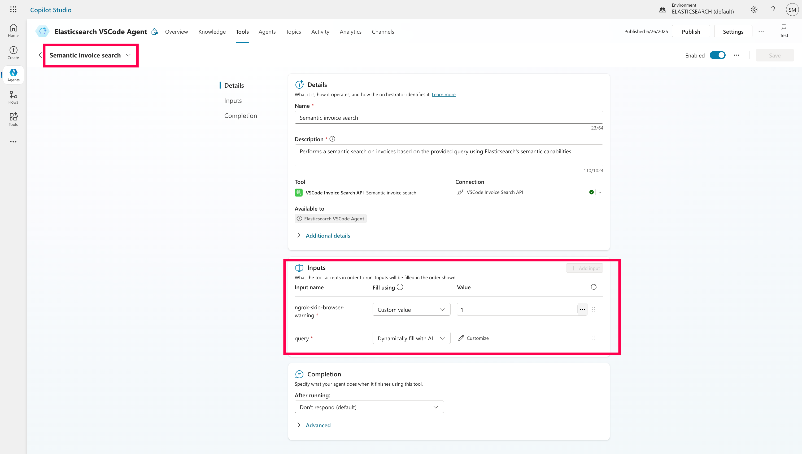

### Building Smart LLM Agents with Elasticsearch and Microsoft Copilot Studio



If you've ever thought about combining the power of `Elasticsearch` with the conversational capabilities of `Microsoft Copilot`, you're in the right place. I recently explored this integration end-to-end using invoices as a sample dataset to make it easy for `FinOps` stakeholders. But don’t let that limit your imagination, this approach makes even more sense for `DevOps teams` or any domain where querying services and infrastructure through natural language could boost productivity. Here's how I pulled it off.

---

#### Prerequisites:

- Elasticsearch deployment *(local or Elastic Cloud)*
  * Get Elastic Cloud Endpoint
  * Generate an `API Key` in Kibana for authentication
- Sign up for an `ngrok account` to `generate an auth token` and enable public tunneling to your local API.
- Make sure to install required `Python dependencies` for running the `notebook`, or simply upload the notebook in `Google Colab` for a quick start.
- Sign up for a `Microsoft Copilot Studio account` to create and manage your smart agents.

```bash
# Keep these values handy:
Ngrok Auth Token: 2sxxxxxxxxtuJwnADnlp_7xVN8PZuJC9X8ALTFXv2B
Elasticsearch Endpoint: https://elasticsearch-example-cloud-deployment.es.eastus2.azure.elastic-cloud.com
Elasticsearch API Key: RElkcXxxxxxxxxxA6WWtjUGs5OTFTT1Mtc2lxbzU0cC1rUQ==
```

---

#### Step 1: Connect to Elasticsearch (Locally and on Cloud)
I started by spinning up an Elasticsearch client instance locally and connected it to my Elastic Cloud deployment. Nothing fancy here yet, just the usual `Elasticsearch` Python client _(you can follow the [official getting started guide here](https://www.elastic.co/docs/reference/elasticsearch/clients/python/getting-started#_connecting))_ and some environment variables for auth.

Also, to make sure the ML pipelines work, make sure you have ML nodes available in your Elasticsearch setup, whether locally or in Elastic Cloud. If you're running Elasticsearch locally, note that you’ll need an enterprise subscription to enable machine learning and inference features. But to be honest, my recommendation is to quickly make use of an Elastic Cloud trial if you're just testing it out, it's easier and comes ready with ML capabilities. Whether locally or in Elastic Cloud. This is necessary to deploy the ELSER model for semantic embeddings and to support the `semantic_text` field during ingestion. Deploying this model will create an inference endpoint, enabling semantic ingestion capabilities. _You can learn more about ELSER v2 in the [official Elastic documentation](https://www.elastic.co/docs/explore-analyze/machine-learning/nlp/ml-nlp-elser#elser-v2)._

#### Quick Testing:

```curl
curl --location --request PUT '<elasticsearch_endpoint>/<your_index_name>' \
--header 'Authorization: ApiKey <ADD_YOUR_API_KEY>' \
--header 'Content-Type: application/json' \
--data '{
    "mappings": {
      "properties": {
        "title": { "type": "text" },
        "amount": { "type": "float" },
        "created_at": { "type": "date" }
      }
    }
  }'
```
- Feel free to check this documentation to get an idea for connecting the client: https://www.elastic.co/docs/reference/elasticsearch/clients/python/connecting.

```python
_client = Elasticsearch(
    os.environ["ELASTICSEARCH_ENDPOINT"],
    api_key=os.environ["ELASTICSEARCH_API_KEY"],
)

_client.info()
```

---

#### Step 2: Add Machine Learning Models
To get semantic search working, I deployed an ML model in Elasticsearch. This lets us enable a special `semantic_text` field in the mapping later on. The model helps Copilot understand queries like "food expenses" even if the actual invoices say "lunch with client" instead.

You can **Download** and **Deploy** it:



---

#### Step 3: Create the `invoices` Index with Mappings
Once the ML model was ready, I created an index called `invoices` and added appropriate mappings, including the semantic-enabled field. Here's where I define fields like `description`, `total_amount`, `issue_date`, and the `semantic_text` field powered by our ML model. If you face any timeouts or ML-related errors at this point, try again after a few minutes, it's likely the model is still in the deploying state. It typically takes under 5 minutes for it to become fully available.

##### Example Document:
```json

{
    "id": "INV-0004",
    "file_url": "https://fake-invoices.example.com/fake/INV-0004.pdf",
    "issue_date": "2025-04-07",
    "description": "CRM system implementation",
    "services": [
      { "name": "CRM setup", "price": 2500.0 },
      { "name": "User training", "price": 700.0 }
    ],
    "total_amount": 3200.0
}
```

```json
{
    "mappings": {
        "properties": {
            "id": {"type": "keyword"},
            "file_url": {"type": "keyword"},
            "issue_date": {"type": "date"},
            "description": {"type": "text", "copy_to": "semantic_field"},
            "services": {
                "type": "object",
                "properties": {
                    "name": {
                        "type": "text",
                        "copy_to": "semantic_field",
                    },
                    "price": {"type": "float"},
                },
            },
            "total_amount": {
                "type": "float",
            },
            "semantic_field": {"type": "semantic_text"},
        }
    }
}
```

- Create index with the above mappings _(handling exception)_:

```python

try:
    _client.indices.create(
        index=INDEX_NAME,
        body={
            "mappings": {
                "properties": {
                    "id": {"type": "keyword"},
                    "file_url": {"type": "keyword"},
                    "issue_date": {"type": "date"},
                    "description": {"type": "text", "copy_to": "semantic_field"},
                    "services": {
                        "type": "object",
                        "properties": {
                            "name": {
                                "type": "text",
                                "copy_to": "semantic_field",
                            },
                            "price": {"type": "float"},
                        },
                    },
                    "total_amount": {
                        "type": "float",
                    },
                    "semantic_field": {"type": "semantic_text"},
                }
            }
        },
    )

    print("index created successfully")
except Exception as e:
    print(
        f"Error creating inference endpoint: {e.info['error']['root_cause'][0]['reason'] }"
    )
```

- Bulk ingest the invoice payload:

```python
with open("invoices_data.json", "r", encoding="utf-8") as f:
    invoices = json.load(f)

def build_data():
    for doc in invoices:
        yield {"_index": INDEX_NAME, "_source": doc}


try:
    success, errors = bulk(_client, build_data())
    print(f"{success} documents indexed successfully")

    if errors:
        print("Errors during indexing:", errors)

except Exception as e:
    print(f"Error: {str(e)}, please wait some seconds and try again.")
```
> Note, once the ingestion is completed, you can cross-verify the INDEX_NAME(e.g.: invoices) in the `Index Management` for ingestion of documents in Kibana.

----
#### Step 4: Build the API Using FastAPI and ngrok
Now comes the fun part: building a REST API that will expose our search functionality.

- **FastAPI** to serve our semantic and date-range search endpoints
- **ngrok** to expose the local server publicly so Microsoft Copilot can reach it

The two endpoints we created:
- `/search/semantic` for free-text queries
- `/search/by-date` for filtering based on date ranges

These endpoints are designed to be `read-only` so that our NLP queries from `Copilot Agents` don’t accidentally modify existing indices. Of course, if you're experimenting or building something more interactive, feel free to extend it further based on your needs!

```python
@app.get("/search/semantic")
async def search_semantic(query: str = Query(None)):
    try:
        result = _client.search(
            index=INDEX_NAME,
            query={
                "semantic": {
                    "field": "semantic_field",
                    "query": query,
                }
            },
        )

        hits = result["hits"]["hits"]
        results = [{"score": hit["_score"], **hit["_source"]} for hit in hits]

        return results
    except Exception as e:
        return Exception(f"Error: {str(e)}")


@app.get("/search/by-date")
async def search_by_date(from_date: str = Query(None), to_date: str = Query(None)):
    try:
        from_dt = datetime.strptime(from_date, "%m/%d/%Y %I:%M:%S %p")
        to_dt = datetime.strptime(to_date, "%m/%d/%Y %I:%M:%S %p")

        formatted_from = from_dt.strftime("%d/%m/%Y")
        formatted_to = to_dt.strftime("%d/%m/%Y")

        result = _client.search(
            index=INDEX_NAME,
            query={
                "range": {
                    "issue_date": {
                        "gte": formatted_from,
                        "lte": formatted_to,
                        "format": "dd/MM/yyyy",
                    }
                }
            },
        )

        hits = result["hits"]["hits"]
        results = [hit["_source"] for hit in hits]

        return results
    except Exception as e:
        return Exception(f"Error: {str(e)}")
```

---

#### Step 5: Create the Agent in Microsoft Copilot Studio
This is where it all comes together. In **Microsoft Copilot Studio** - https://copilotstudio.microsoft.com:

1. I created a new **Agent** called `Elasticsearch VSCode Agent`
2. `Description`: "Invoice Agent to retrieve data from Elasticsearch"
3. `Prompt`: _"You are an useful agent for consulting information related to company expenses in the form of invoices. You would need to provide the output response in a formatted information and in a readable way."_



---

#### Step 6: Add Tools (Our API) to the Agent *(formerly called Actions)*

In the Agent, I went to **Tools** and added a new `REST API` by uploading our ready `OpenAPI specifications` for `semantic search` and `search by date`. This file includes both our endpoints, and I updated the `host` field to match my `ngrok` tunnel (minus the `https://`).

Don’t forget to handle the `ngrok-skip-browser-warning` header if you're using the free tier of ngrok. It trips up Copilot unless you bypass it. By default, Copilot assumes it can dynamically query this value, but you’ll want to change it to a `custom value` and set it to `1`. Do this for both the REST API connectors before attaching them to the Agent.









---

#### Step 7: Connect Everything & Test and Then, Publish
After adding the API to the Agent, I linked the tools and tested a few natural language queries like:

- _"What are the invoices available for the last 2 days?"_
- _"Show me food-related expenses."_
- _"Do I have any food expenses related invoices?"_
- _"Do I have electronics related invoices?"_


Copilot responded with well-formatted results pulled live from Elasticsearch. It even handled semantic variations correctly thanks to the ML-powered `semantic_text` field.

You can extend this to `Channels` and include it to `Teams` and `Copilot Chat`.

---

#### Final Thoughts
This entire process feels like giving `Elasticsearch` a voice. You build the brains with `Elastic Elser v2` built-in Sparse Vector Model and fast APIs, and `Copilot` brings the conversation. If you're working with company data and want to surface it more intuitively inside Teams or the Microsoft 365 ecosystem, this is a powerful pattern to try.

I'm attaching the GitHub repo along with the Jupyter notebook (`.ipynb`), the OpenAPI specifications, and a sample `invoices.json` payload for reference. This includes everything you need to ingest documents into Elasticsearch and try it out end-to-end.

Give it a try and let me know your feedback! In the next article, we'll dive into `MCP (Model Context Protocol)`, since what we've done here acts as a precursor to setting up a proper MCP Server.

**Credits:** Inspired by [Elastic's guide on enhancing Microsoft Copilot with Elasticsearch](https://www.elastic.co/search-labs/blog/improve-microsoft-copilot-with-elasticsearch).

---
#### License
This project is licensed under the **MIT License**.

---